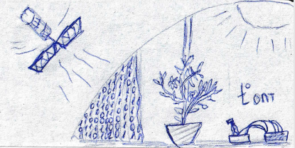
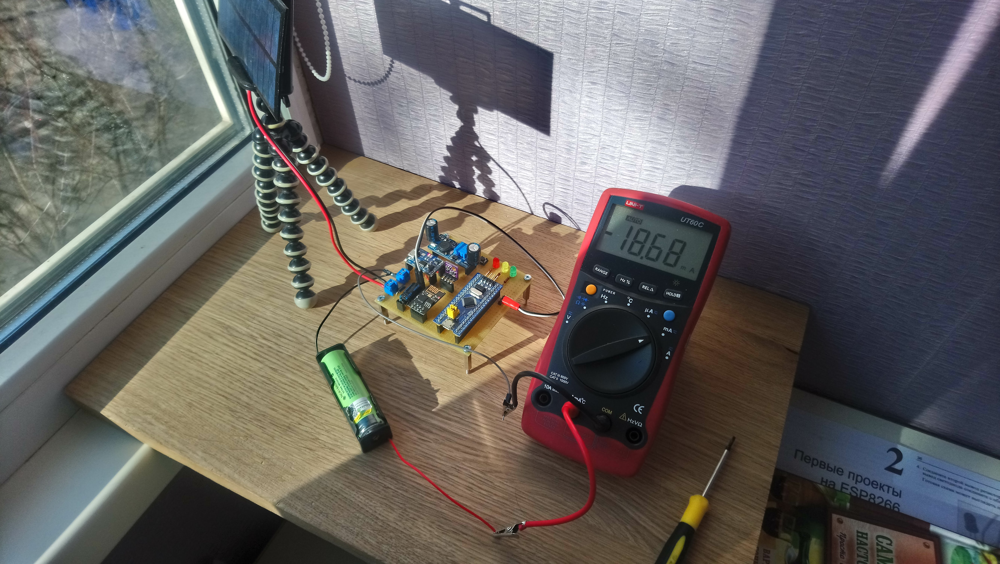

# WeatherStation

  

The main goal of the project is to create an autonomous Wi-Fi weather station based on STM32F103. ESP-01 is used for transmitt data to server and BME280 for getting temperature, humidity, pressure readings. 
 
 

  

