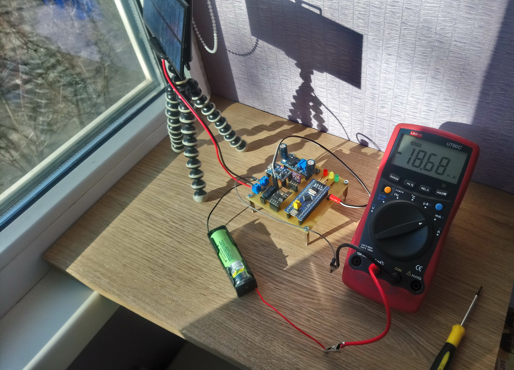

# WeatherStation

  

The main goal of the project is to create an autonomous Wi-Fi weather station based on STM32F103. ESP-01 is used for transmitt data to server and BME280 for getting temperature, humidity, pressure readings. 
 
 

  

 

In the dark, the work of the station is provided by a 18650 lithium-ion battery, and in the light by the solar panel, which charges the battery and provides sleep power.

 

  

